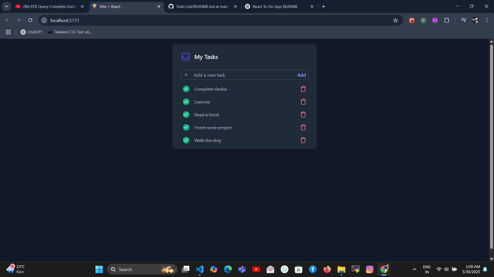

# 📝 React To-Do List App

A minimal yet powerful To-Do List application built with **React**, styled using **Tailwind CSS**, and powered by **RTK Query** for efficient API interaction. The app performs CRUD operations with a mock REST API using `json-server`.

## 🚀 Features

- ✅ Add new to-do items
- 🗑️ Delete tasks
- ✅ Checking Animation on Completed Items
- 🔄 Fetch data from `json-server` backend
- 🎨 Fully responsive UI with Tailwind CSS
- ⚡ Powered by Redux Toolkit Query (RTK Query) for data fetching and caching

## 🛠️ Technologies Used

- [React](https://reactjs.org/)
- [Tailwind CSS](https://tailwindcss.com/)
- [Redux Toolkit & RTK Query](https://redux-toolkit.js.org/)
- [json-server](https://github.com/typicode/json-server)

## 📦 Installation

1. **Clone the repository**
   ```bash
   git clone https://github.com/your-username/your-repo-name.git
   cd your-repo-name


📁 Project Structure
/src
  ├── app/
  ├── components/
  ├── features/todos/
  ├── services/api.js
  ├── App.jsx
  └── main.jsx
db.json


📷 Screenshots


🤝 Contributing
Pull requests are welcome. For major changes, please open an issue first to discuss what you would like to change.

📄 License
This project is open-source and available under the MIT License.

yaml
Copy
Edit

---

Let me know if you want me to include badges, deploy links (like Vercel or Netlify), or update it with your GitHub repo name.


Project Structure


